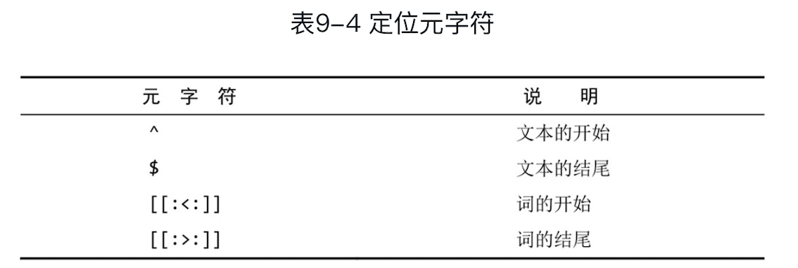

[TOC]

### 正则表达式

正则表达式区分大小写 REGEXP BINARY:

```sql
SELECT * FROM XX WHERE FIELD REGEXP BINARY 'Sample|As|[SM]';
```

转义：

```
\\. 匹配.
\\n 匹配换行
\\r 匹配回车
\\\ 匹配\
```




​	可以在不使用数据库表的情况下用SELECT来测试正则表达式。REGEXP检查总是返回0（没有匹配）或1（匹配）。可以用带文字串的REGEXP来测试表达式，并试验它们。相应的语法如下：

```sql
SELECT 'hello' REGEXP '[0-9]';
```


### 数据处理函数

省略 FROM 子句测试表达式

```sql
SELECT Trim('abc')；
```

#### 1. 文本处理函数

拼接字段 Concat()，别名 AS

```sql
SELECT Concat(name, '(', address, ')') AS title FROM user;
```

去除空格 RTrim(), LTrim(), Trim()

```sql
SELECT Trim(name) FROM user;
```

转换大写 Upper()

```sql
SELECT Upper(name) FROM user;
```


#### 2. 日期和时间处理函数


日期格式为 yyyy-mm-dd

```sql
SELECT name FROM orders WHERE Year(order_date) = 2020 AND Month(order_date) = 9;
```

#### 3. 数值处理函数


### 数据汇总函数


*AVG、MAX、MIN、SUM函数忽略列值为$NULL的行*

COUNT(*) 对表中行的数目进行计数，包含NULL值；COUNT(column) 对特定列中有值的行计数，忽略NULL值。

DISTINCT 必须使用列名

```sql
SELECT AVG(DISTINCT price) AS avg_price FROM product;
```


### 数据分组

**GROUP**: 分组允许把数据分为多个逻辑组，以便能**对每个组**进行聚集计算。

```sql
SELECT vender_id, COUNT(*) AS num_prods FROM products GROUP BY vender_id;
```

- GROUP BY 子句可以包含任意数目的列
- 除聚集计算语句外，SELECT语句中的每个列都必须在GROUP BY子句中给出。
- 如果分组列中具有NULL值，则NULL将作为一个分组返回。如果列中有多行NULL值，它们将分为一组。
- WITH ROLLUP 返回分组汇总之后的值

```sql
SELECT coalesce(name, '总金额'), SUM(money) AS money FROM products GROUP BY name WITH ROLLUP;
```

**HAVING** 支持所有 WHERE 操作符，规定包括哪些分组，排除哪些分组

```sql
SELECT cust_id, COUNT(*) AS orders 
FROM orders 
WHERE prod_price >= 10
GROUP BY cust_id 
HAVING COUNT(*) >= 2
ORDER BY orders
```

​	WHERE 在数据分组前进行过滤，HAVING 在数据分组后进行过滤。


### 子查询

嵌套在其他查询中的查询，不要嵌套太多子查询

1. 子查询作为条件

```sql
SELECT cust_name 
FROM customers
WHERE cust_id IN (SELECT cust_id 
                  FROM orders
                 	WHERE order_num IN (SELECT order_num
                                      FROM orderitems
                                      WHERE prod_id = 'APPLE'));
```

2. 子查询作为计算字段

```sql
SELECT cust_name, 
			 cust_state, 
			 (SELECT COUNT(*) FROM orders WHERE orders.cust_id = customers.cust_id) AS orders
FROM customers
ORDER BY cust_name;
```


### 联结 JOIN

外键为某个表中的一列，包含另一个表的主键值，定义了两个表之间的关系。

```sql
SELECT vend_name, prod_name, prod_price
FROM venders, products
WHERE venders.vender_id = products.vender_id
ORDER BY vender_name, prod_name;
```

```sql
SELECT vend_name, prod_name, prod_price
FROM venders INNER JOIN products
ON venders.vender_id = products.vender_id
ORDER BY vender_name, prod_name;
```

减少不必要的联结，联结的表越多，性能下降越厉害。

```sql
SELECT cust_name
FROM customers AS c, orders AS o, orderitems AS oi
WHERE c.cust_id = o.cust_id
	AND oi.order_num = o.order_num
	AND prod_id = 'APPLE';
```

自联结

```sql
SELECT p1.prod_id, p1.prod_name
FROM products AS p1, products AS p2
WHERE p1.vender_id = p2.vender_id
	AND p2.prod_id = 'XXX'
```

外部联结

```sql
SELECT vend_name, COUNT(products.prod_id)
FROM venders LEFT OUTER JOIN products
ON venders.vender_id = products.vender_id
GROUP BY venders.vender_id
ORDER BY vender_name;
```

### 组合查询

- 在单个查询中从不同的表返回类似结构的数据
- 对单个表执行多个查询，按单个查询返回数据

多数情况下，结合相同表的两个查询完成的工作与具有多个where子句条件的单条查询完成的工作相同。

```sql
SELECT vender_id, prod_id, prod_price
FROM products
WHERE prod_id <= 5
UNION
SELECT vender_id, prod_id, prod_price
FROM products
WHERE vender_id IN (1001, 1002)
ORDER BY vender_id, prod_price
```

```sql
SELECT vender_id, prod_id, prod_price
FROM products
WHERE prod_id <= 5
	OR vender_id IN (1001, 1002)
ORDER BY vender_id, prod_price
```

​	UNION 中每个查询必须包含相同的列、表达式或聚集函数（次序不需要相同）；类数据类型必须兼容但不必相同。

​	UNION 从查询结果中自动去除了重复的行，使用 *UNION ALL* 返回所有匹配行。


### 全文搜索

​	mysql 最常用的引擎中，MyISAM支持全文搜索，InnoDB不支持。

​	为了进行全文本索引，必须索引被搜索的列，而且要随着数据的改变不断地重新索引。在对列表进行适当设计后，Mysql会自动进行所有的索引和重新索引。在索引之后，SELECT 可与 Match() 和 Against() 一起使用以实际执行搜索。

​	创建表时启用全文本搜索，CREATE TABLE 语句接收 FULLTEXT 子句，它给出被索引的一个逗号分隔的列表。

```sql
CREATE TABLE productnotes
(
	note_id		int				NOT NULL 	AUTO_INCREMENT,
  prod_id 	char(10) 	NOT NULL,
  note_date	datetime	NOT NULL,
  note_text	text			NULL,
  PRIMARY KEY(note_id),
  FULLTEXT(note_text)
)	ENGINE=MyISAM;
```

​	Match() 函数指定被搜索的列，Against() 函数指定要使用的搜索表达式；返回以文本匹配的良好程度排序的数据，等级由 MYSQL 根据行中词的数目、唯一词的数目、整个索引中词的总数以及包含该词的行的数目计算出来。

```sql
SELECT note_text, 
			 Match(note_text) Against('rabbit') AS rank
FROM productnotes;
```

```sql
SELECT note_text
FROM productnotes
WHERE Match(note_text) Against('rabbit');
```

​	除非使用BINARY，否则全文本搜索不区分大小写。Match() 的值必须与FULLTEXT 定义中的相同。

​	效果与下面语句相同：

```sql
SELECT note_text
FROM productnotes
WHERE note_text LIKE '%rabbit%';
```

#### 查询拓展（version>=4.1.1）

- 首先，进行一个基本的全文本搜索，找出与搜索条件匹配的所有行
- 其次，MYSQL 检查这些匹配行并选择所有有用的词
- 最后，MYSQL 再次进行全文本搜索，使用所有有用的词

表中的行越多，查询拓展返回的结果越好。

```sql
// 只返回包含 anvils 的行
SELECT note_text
FROM productionnotes
WHERE Match(note_text) Against('anvils');
```

```sql
// 查询拓展
SELECT note_text
FROM productionnotes
WHERE Match(note_text) Against('anvils' WITH QUERY EXPANSION);
```

#### 布尔文本搜索

- 要匹配的词
- 要排斥的词
- 排列提示
- 表达式分组等

布尔文本搜索是非常缓慢的操作，即使没有定义 FULLTEXT 也可以使用。

```sql
// 包含 anvils
SELECT note_text
FROM productionnotes
WHERE Match(note_text) Against('anvils' IN BOOLEAN MODE);
```

```sql
// 包含 (可选)anvils 和 (必选)heavy，增加前者的等级，降低后者的等级，排除rope开始的词
SELECT note_text
FROM productionnotes
WHERE Match(note_text) Against('>anvils +(<heavy) -rope*' IN BOOLEAN MODE);
```


#### 重要说明

- 索引全文本数据时，短词被忽略且从索引中排除。短词定义为那些具有3个或3个以下字符的词，数目可更改
- MYSQL 自带一个内建的停用词列表，这些词在索引全文本数据时总是被忽略，如果需要，可以覆盖
- 许多词出现的频率很高，搜索他们没有用处，因此，MYSQL 规定了一条50%规则，如果一个词出现在50%以上的行中，则将它作为一个停用词忽略。50%规则不用于 IN BOOLEAN MODE
- 如果表中的行数少于3行，则全文本搜索不返回结果（因为每个词或者不出现，或者至少出现在50%的行中）
- 忽略词中的单引号
- 不具有词分隔符的语言不能恰当地反回全文本搜索结果，比如汉语
- 仅MyISAM引擎支持全文本搜索


### 插入数据

```sql
INSERT INTO customers(
                      cust_name,
                      cust_city)
VALUES('a', 'shanghai')
```

insert select 

```sql
INSERT INTO customers(cust_id,
                      cust_name,
                      cust_city)
SELECT cust_id,
	cust_name,
	cust_city
FROM custnew;
```

​	为简单起见，这个例子在INSERT和SELECT语句中使用了相同的列名。但是，不一定要求列名匹配。事实上，MySQL甚至不关心SELECT返回的列名。它使用的是列的位置，因此SELECT中的第一列（不管其列名）将用来填充表列中指定的第一个列，第二列将用来填充表列中指定的第二个列，如此等等。这对于从使用不同列名的表中导入数据是非常有用的。

### 更新数据

#### UPDATE

基本的UPDATE语句由3部分组成，分别是：

❑ 要更新的表；

❑ 列名和它们的新值；

❑ 确定要更新行的过滤条件。

```sql
UPDATE customers
SET cust_email = 'a@163.com',
		cust_name = 'Fudds'
WHERE cust_id = 1005;
```

​	即使是发生错误，也继续进行更新，可使用IGNORE关键字，如下所示：

```sql
UPDATE IGNORE customers…
```

#### DELETE

```sql
DELETE FROM customers WHERE cust_id = 1006;
```

​	如果想从表中删除所有行，不要使用DELETE。可使用TRUNCATE TABLE语句，它完成相同的工作，但速度更快（TRUNCATE实际是删除原来的表并重新创建一个表，而不是逐行删除表中的数据）。

​	使用强制实施引用完整性的数据库(外键)，**这样MySQL将不允许删除具有与其他表相关联的数据的行**。