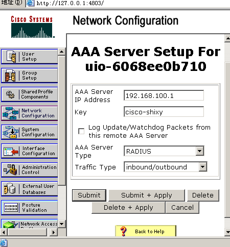
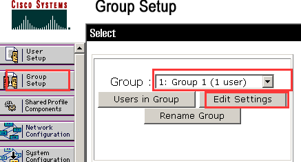
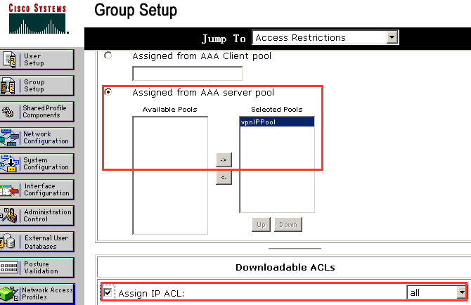

使用AAA确保网络安全访问

## Definition

AAA 是`authentication`（认证）、`authorization`（授权）和`accounting`（计费）的简称。它提供对用户进行`认证`、`授权`和`计费`三种安全功能。

* `认证 (authentication)`：认证用户是否可以获得访问权，确定哪些用户可以访问网络。
* `授权 (authorization)`：授权用户可以使用哪些服务。
* `计费 (accounting)`：记录用户使用网络资源的情况。

AAA 一般采用客户／服务器结构，客户端运行于被管理的资源侧，服务器上则集中存放用户信息。常用的AAA协议是`Radius`，是`remote authentication dial-in user service（远程认证拨号用户服务）`的简称，通常将认证和授权结合在一起。

## Demand  

### description

1. 搭建互联网WAN环境内用户访问LAN环境中的服务资源；
2. 使用AAA对LAN内用户和WAN内用户做认证；
3. 使用AAA为不同特权级别的用户赋予不同的命令或者资源。

### analysis

搭建网络资源并对LAN内用户和WAN内用户做认证，要求最少三台机器，一台WAN用户，一台LAN用户，一台服务器。使用Radius协议的AAA服务的话，就需要对网络资源ip进行分配，这样就最少需要两台服务器，才能凸显出认证授权的效果：一台服务器上的资源都可以访问，另一台服务器上的资源需要特殊权限才能访问。设计的网络拓扑图如下所示。

<div align="center">
	
	<p>图 2-1 网络拓扑图</p>
</div>

设计的网络服务资源部署如下表。

表1 网络服务资源部署
<table>
	<tr>
		<th></th>
		<th>ACS Server</th>
		<th>Web Server</th>
		<th>IIS访问受限</th>
	</tr>
	<tr>
		<td>Home</td>
		<td></td>
		<td align="center">☆</td>
		<td></td>
	</tr>
	<tr>
		<td>acs.page1</td>
		<td align="center">☆</td>
		<td></td>
		<td></td>
	</tr>
	<tr>
		<td>acs.page2</td>
		<td align="center">☆</td>
		<td></td>
		<td align="center">☆</td>
	</tr>
	<tr>
		<td>web.page1</td>
		<td></td>
		<td align="center">☆</td>
		<td></td>
	</tr>
	<tr>
		<td>web.page2</td>
		<td></td>
		<td align="center">☆</td>
		<td align="center">☆</td>
	</tr>
</table>

设计的不同级别用户的访问权限如下表。

表2 不同级别用户的访问权限
<table>
	<tr>
		<th></th>
		<th></th>
		<th>Home</th>
		<th>acs.page1</th>
		<th>acs.page2</th>
		<th>web.page1</th>
		<th>web.page2</th>
	</tr>
	<tr>
		<td>Wan用户</td>
		<td>shixy-some</td>
		<td align="center">☆</td>
		<td align="center"></td>
		<td align="center"></td>
		<td align="center">☆</td>
		<td align="center">IIS授权</td>
	</tr>
	<tr>
		<td>Wan用户</td>
		<td>shixy-all</td>
		<td align="center">☆</td>
		<td align="center">☆</td>
		<td align="center">IIS授权</td>
		<td align="center">☆</td>
		<td align="center">IIS授权</td>
	</tr>
	<tr>
		<td>Lan用户</td>
		<td></td>
		<td align="center">☆</td>
		<td align="center">☆</td>
		<td align="center">IIS授权</td>
		<td align="center">☆</td>
		<td align="center">IIS授权</td>
	</tr>
</table>

## Implementation(virtual machine)

### configuration

#### virtual machine

1. ACS服务器（Windows server 2003）

<div align="center">
	
	<p>图 3-1-1  ACS 服务器虚拟机网络配置——仅主机模式</p>
</div>
<div align="center">
	
	<p>图 3-1-2  ACS 服务器ip地址配置</p>
</div>


2. Web Server服务器（Windows server 2003）

<div align="center">
	
	<p>图 3-1-3  Web 服务器虚拟机网络配置——仅主机模式</p>
</div>
<div align="center">
	
	<p>图 3-1-4  Web服务器ip地址配置</p>
</div>


3. 模拟wan环境中用户虚拟机（Windows XP）
<div align="center">
	
	<p>图 3-1-5 模拟wan环境中用户虚拟机配置——桥接物理无线网卡</p>
</div>
<div align="center">
	
	<p>图 3-1-6 模拟wan环境中用户ip地址配置</p>
</div>


#### internet resources

1. 在Windows server 2003虚拟机上开启IIS服务。
<div align="center">
	
	<p>图 3-2-1 开启IIS服务</p>
</div>


2. 将写好的网站资源文件部署到默认网站下面。
<div align="center">
	
	<p>图 3-2-2  ACS服务器下网站资源文件部署</p>
</div>
<div align="center">
	
	<p>图 3-2-3 Web 服务器下网站资源文件部署</p>
</div>

#### IIS 权限配置

1. 安装域控制器（Active Directory），在ACS服务器中域名为uio.acs.test，在Web服务器中域名为uio.acs.test。
2. 在两台服务器中都创建Active Directory用户shixy，并配置密码。
3. 在两台服务器中都创建Active Directory组vistor，并将用户shixy加入到组victor中

<div align="center">
	
	<p>图 3-3-1 创建Active Directory组和用户</p>
</div>

4. 配置IIS - source文件夹权限，添加vistor组，并设置访问权限。

<div align="center">
	
	<p>图 3-3-2 添加vistor组，并设置访问权限</p>
</div>

5. 配置page2 的目录安全性：page2 -> 属性 –> 文件安全性 -> 编辑，为了方便测试，选择基于身份验证，领域选择前面配好的域，并取消匿名访问。
<div align="center">
	
	<p>图 3-3-3 目录安全性</p>
</div>
<div align="center">
	
	<p>图 3-3-4 启用身份验证</p>
</div>

#### ACS服务器配置

1. 在Windows Server 2003 for ACS虚拟机上安装 CiscoSecure ACS v4.0 for Windows Server，并启动。
<div align="center">
	
	<p>图3-4-1  ACS初始化</p>
</div>

2. 配置AAA客户端。选择服务器网关作为客户端，key填cisco-shixy，会在后面ASA配置中用到；认证方式选择RADIUS。
<div align="center">
	
	<p>图 3-4-2 配置ACS客户端</p>
</div>

3. 配置AAA服务端。Key同上，type选择RADIUS。
<div align="center">
	
	<p>图 3-4-3  配置ACS服务端</p>
</div>
<div align="center">
	
	<p>图 3-4-4 网络配置完成</p>
</div>

4. 配置动态ACL，即访问控制列表（Access Control List，ACL）
<div align="center">
	
	<p>图 3-4-5 接口配置选项</p>
</div>
<div align="center">
	
	<p>图 3-4-6 选中level Downloadable ACLs</p>
</div>
<div align="center">
	
	<p>图 3-4-7 配置 SharedProfile Components</p>
</div>
<div align="center">
	
	<p>图 3-4-8 为some配置ACL</p>
</div>
<div align="center">
	
	<p>图 3-4-9 配置准入规则</p>
</div>
<div align="center">
	
	<p>图 3-4-10 ACL配置完成</p>
</div>
<div align="center">
	
	<p>图 3-4-11 为all配置准入列表</p>
</div>
<div align="center">
	
	<p>图 3-4-12  all配置完成</p>
</div>
<div align="center">
	
	<p>图 3-4-13  ACLs配置完成</p>
</div>

5. 创建ip池——为远程vpn访问的用户准备的ip地址。
<div align="center">
	
	<p>图 3-4-14 配置接口规则</p>
</div>
<div align="center">
	
	<p>图 3-4-15 增加ip pools选项</p>
</div>
<div align="center">
	
	<p>图 3-4-16 系统配置</p>
</div>
<div align="center">
	
	<p>图 3-4-17 配置ip pools</p>
</div>
<div align="center">
	
	<p>图 3-4-18  IP Pools配置完成</p>
</div>

6. 创建使用vpn的用户shixy-some和shixy-all。
<div align="center">
	
	<p>图 3-4-19 创建用户shixy-some</p>
</div>
<div align="center">
	
	<p>图 3-4-20 为用户shixy-some配置密码和组</p>
</div>
<div align="center">
	
	<p>图 3-4-21 为用户shixy-all配置密码和组</p>
</div>
<div align="center">
	
	<p>图 3-4-22 用户配置完成</p>
</div>

7. 配置不同组的访问权限。
<div align="center">
	
	<p>图 3-4-23 配置组1</p>
</div>
<div align="center">
	
	<p>图 3-4-24 为组1配置ACL和ip分配规则</p>
</div>
<div align="center">
	
	<p>图 3-4-25 配置组2</p>
</div>
<div align="center">
	
	<p>图 3-4-26 为组2配置ACL和ip分配规则</p>
</div>

#### ASA防火墙配置

1. 安装串口模拟器Named Pipe Tcp Proxy，并新增串口配置如下图

<div align="center">
	
	<p>图 3-5-1 pipe配置</p>
</div>

2. 安装ASA-8.42虚拟机，并配置虚拟机网卡参数如下图。ASA连接了Server、模拟wan用户和lan用户。
<div align="center">
	
	<p>图 3-5-2 ASA虚拟机配置</p>
</div>

3. 用SecureCRT 工具telnet到ASA，进行ASA配置，具体配置在第四部分详细说明。
<div align="center">
	
	<p>图 3-5-3  ASA接口配置</p>
</div>
<div align="center">
	
	<p>图 3-5-4  ASA配置EasyVPN</p>
</div>

#### VPN客户端配置

1. 在模拟wan用户（XP 桥接wlan网卡）机器下安装vpnclient-win。
2. 安装完成后新建一个vpn连接，具体如下。
<div align="center">
	
	<p>图 3-6-1 新建一个vpn连接</p>
</div>
<div align="center">
	
	<p>图 3-6-2 vpn连接具体配置（参考第四部分ASA配置）</p>
</div>
<div align="center">
	
	<p>图 3-6-3 vpn新建完成</p>
</div>
<div align="center">
	
	<p>图 3-6-4 vpn连接</p>
</div>
<div align="center">
	
	<p>图 3-6-5 vpn连接成功，本地连接ip地址改变</p>
</div>

### configuration code

1. ASA防火墙接口配置

``````
ciscoasa> enable
ciscoasa# configure terminal  

配置接口0，即VMNet0 。
ciscoasa(config)# interface gigabitEthernet 0
ciscoasa(config-if)# nameif dmz 
INFO: Security level for "dmz" set to 0 by default.
ciscoasa(config-if)# security-level 50
ciscoasa(config-if)# ip add 192.168.100.254 255.255.255.0
ciscoasa(config-if)# no shutdown
ciscoasa(config-if)# exit

配置接口2，即桥接的网卡
ciscoasa(config)# interface gigabitEthernet 2
ciscoasa(config-if)# nameif outside
ciscoasa(config-if)# ip add 202.0.0.254 255.255.255.0
ciscoasa(config-if)# no shutdown
ciscoasa(config-if)# exit
``````

2. ASA防火墙配置Easy VPN

``````
启用AAA服务器使用的协议
ciscoasa(config)# aaa-server aaa protocol radius

指定ACS认证服务器和共享密钥
ciscoasa(config-aaa-server-group)# aaa-server aaa (dmz) host 192.168.100.1
ciscoasa(config-aaa-server-host)# key cisco-shixy
ciscoasa(config-aaa-server-host)# exit

在outside接口处建立第一阶段连接
ciscoasa(config)# crypto isakmp enable outside
ciscoasa(config)# crypto isakmp policy 10  
ciscoasa(config-ikev1-policy)# authentication pre-share
ciscoasa(config-ikev1-policy)# encryption aes
ciscoasa(config-ikev1-policy)# hash sha
ciscoasa(config-ikev1-policy)# group 2
ciscoasa(config-ikev1-policy)# exit

建立隧道组
ciscoasa(config)# tunnel-group ezvpn type ipsec-ra
ciscoasa(config)# tunnel-group ezvpn general-attributes

在隧道通用属性中指定认证服务器
ciscoasa(config-tunnel-general)# authentication-server-group aaa
ciscoasa(config-tunnel-general)# exit

在隧道组中创建共享密钥（在vpn客户端连接时用到）
ciscoasa(config)# tunnel-group ezvpn ipsec-attributes 
ciscoasa(config-tunnel-ipsec)# pre-shared-key cisco-shixy
ciscoasa(config-tunnel-ipsec)# exit

定义传输集
ciscoasa(config)# crypto ipsec transform-set test esp-aes esp-sha-hmac

创建动态加密图
ciscoasa(config)# crypto dynamic-map map1 10 set transform-set test

创建静态加密图
ciscoasa(config)# crypto map cisco 1000 ipsec-isakmp dynamic map1

应用到接口
ciscoasa(config)# crypto map cisco interface outside
``````

## 测试数据及其结果分析

1. shixy-some 的测试
<div align="center">
	
	<p>图 5-1  page home enable</p>
</div>
<div align="center">
	
	<p>图 5-2  web.page1 enable</p>
</div>
<div align="center">
	
	<p>图 5-3  web.page2 需要登陆有权限的AD用户</p>
</div>
<div align="center">
	
	<p>图 5-4  web.page2 登陆错误连续3次之后显示未被授权</p>
</div>
<div align="center">
	
	<p>图 5-5  web.page2 正确登陆显示网页</p>
</div>
<div align="center">
	
	<p>图 5-6  acs.page1和acs.page2点击后打不开页面</p>
</div>


2. shixy-all 的测试
home、web.page1、web.page2测试和shixy-some的测试一致。
<div align="center">
	
	<p>图 5-7  acs.page1 enable</p>
</div>
<div align="center">
	
	<p>图 5-8  acs.page2 需要登陆有权限的AD用户</p>
</div>
<div align="center">
	
	<p>图 5-9  acs.page2 登陆错误连续3次之后显示未被授权</p>
</div>
<div align="center">
	
	<p>图 5-10  acs.page2 正确登陆显示网页</p>
</div>


3. LAN用户验证
LAN用户telnet到ASA服务器（我是在物理主机修改VMNet1网络适配器Ipv4地址和Server同局域网，即192.168.100.*），输入指令test aaa-server authentication aaa host 192.168.100.1，输入用户名、密码进行验证。
<div align="center">
	
</div>
